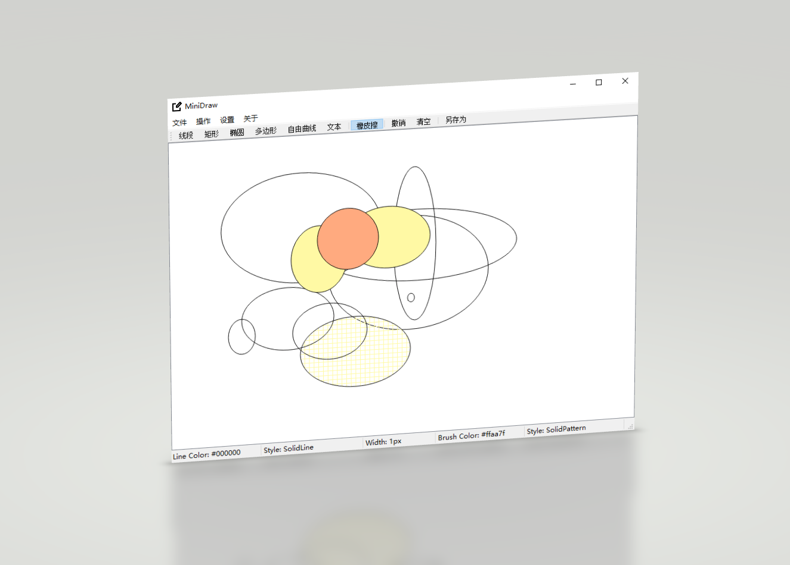

# MiniDraw——一个迷你画图小程序

使用 Qt Graphics View Framework 实现的一个画图小程序，提供的功能有：

- 绘制多种图形：

  - 线段（Line）
  - 矩形（Rectangle）
  - 椭圆（Ellipse）
  - 多边形（Polygon）
  - 自由曲线（Free）
  - 文本（Text）
    - 字体可调整
- 线条属性设置：

  - 线宽
  - 线条颜色
  - 线条风格
- 填充属性设置：

  - 填充颜色
  - 填充风格
- 橡皮擦（Eraser）
- 撤销上一步操作
- 清空绘制内容
- 将画板内容另存为图片

另外，程序界面内容基本以中文呈现。

# 使用

本仓库 Releases 中提供了 Windows 平台下 64 位版本的软件打包文件，可下载直接使用。

若要编译源码，将代码 clone 至本地后转到 MiniDraw 目录下使用 Qt Creator 打开 MiniDraw.pro 即可加载。首次加载会提示配置项目相关内容，按照默认配置即可。

项目开发时的编译器版本：Desktop Qt 5.12.9 MSVC2017 64bit。其它版本未测试，应当可以正常编译。

# 存在问题

- (*) 通过设置 Scene 与 View 部件的相对大小，刻意规避了 Scene 大出视窗导致的坐标转换问题（以边框出现 Scrollbar 为标志）。
- 在文字类型中取消了填充的自定义设置，使之保持与线条颜色一致且永远为实填充风格。
- 自由曲线通过大量直线段首尾连接实现，快速移动鼠标容易出现折角。
- 橡皮擦大小不可以调整（这个属于懒得改lol）。

# 参考

[SouthEastUniversityLinuxClub/MiniDraw](https://github.com/SouthEastUniversityLinuxClub/MiniDraw)

本项目主体框架借鉴了上面的仓库，在学习代码结构的基础上进行了一定的修改。由于是边读代码边学习，本项目代码的注释部分写得相对详luo细suo，可以进一步阅读参考。